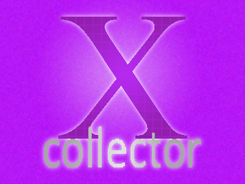

# XCollector
## A simple application designed for collectors.

***

Have you ever just wanted to keep track of your collections? Well now you can. Introducing <b>XCollector</b>.

I have always been a very organized person. It drives me crazy when something isn't organized. So, to make my life easier, I created <b>XCollector</b>.

To use <b>XCollector</b> and inventory your collections just:

* Add a new Collection,
* Add a Series inside the collection,
* Create a new item within that series,
* Add a title,
* Add a picture (Optional, but it makes everything look pretty),
* And add a description (Optional, but it makes everything easier to identify).

