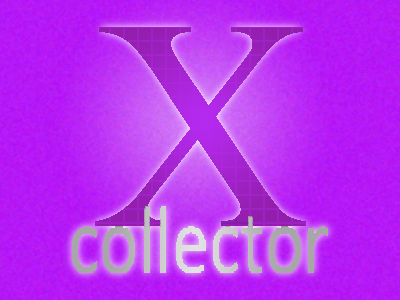

# XCollector
## A simple application designed for collectors.

***

Have you ever just wanted to keep track of your collections? Well now you can. Introducing __XCollector__.

I have always been a very organized person. It drives me crazy when something isn't organized. So, to make my life easier, I created __XCollector__.

To use __XCollector__ and inventory your collections just:

* Add a new Collection,
* Add a Series inside the collection,
* Create a new item within that series,
* Add a title,
* Add a picture (Optional, but it makes everything look pretty),
* And add a description (Optional, but it makes everything easier to identify).

## Here's a checklist of all I have done so far.

- [x] Main Collection GUI
- [x] Creation GUI
- [ ] Ability to create things
- [x] Clickable buttons

Although this project isn't done _yet_, I hope to have it all done in a couple of months. It's not hard, just tedious. But, you probably don't care. All you care about is the final product, and let me tell you... _it will be glorious_.
